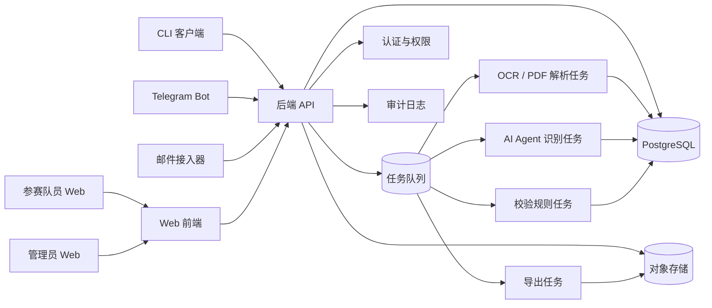
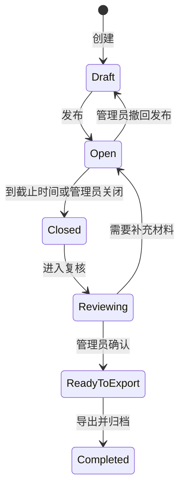
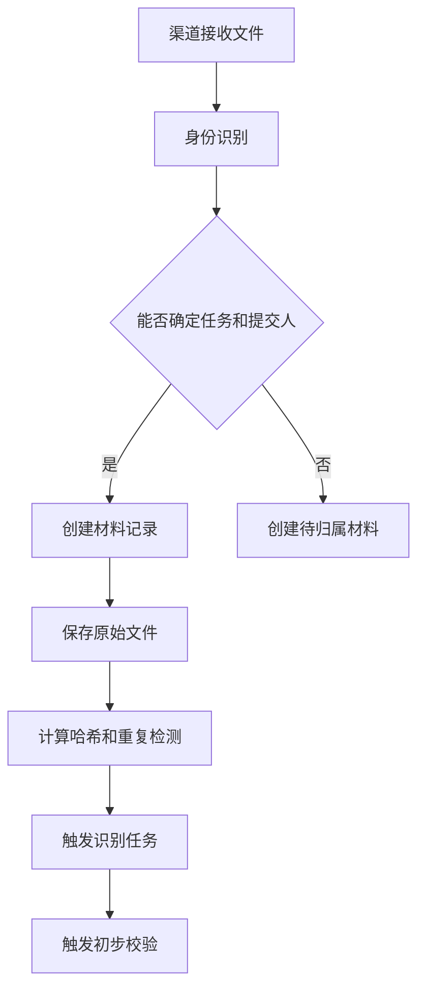
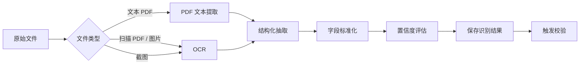
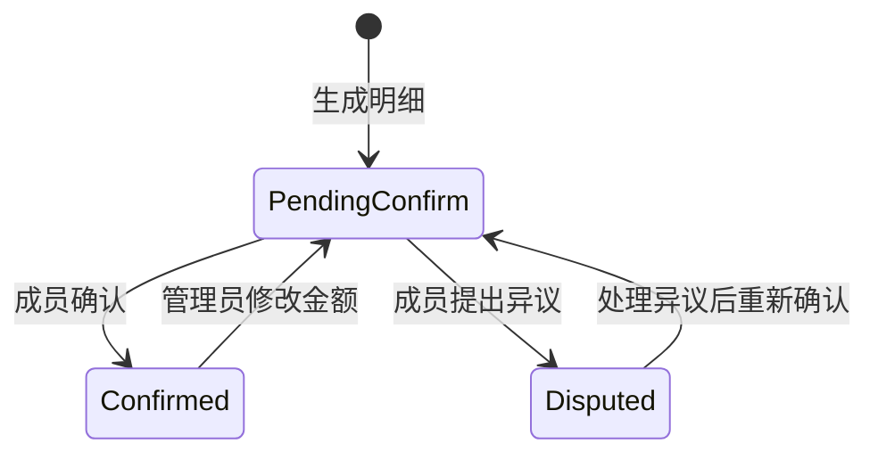
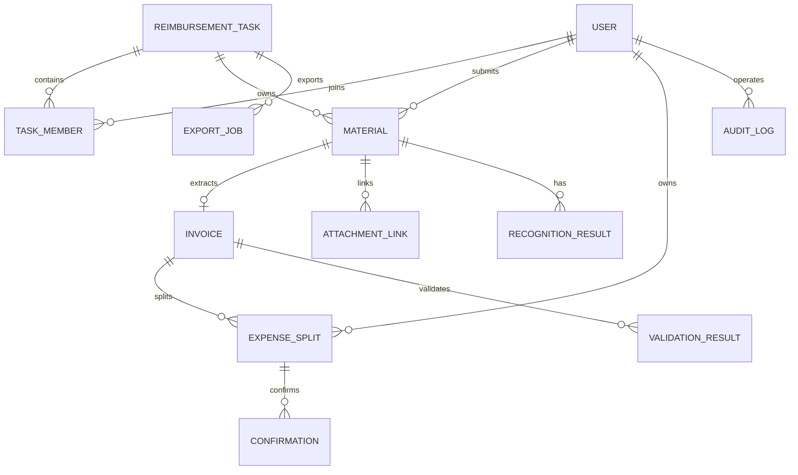

# 同济大学 ACM 竞赛报销收集系统架构设计与技术选型文档

版本：V0.1  
状态：架构设计稿  
依据：`同济大学ACM竞赛报销收集系统需求分析文档_V0.2.md`  
范围：第一阶段交付范围，覆盖材料收集、识别、校验、分摊、确认、复核、导出和 CLI 提交

---

## 1. 设计目标

本系统第一阶段定位为“财务系统录入前的报销材料收集与整理平台”，不直接替代学校财务系统，也不在无人确认时自动提交财务系统。

架构设计目标如下：

1. 将 Web、Telegram、邮件、CLI 等渠道统一收敛到同一材料处理主链路。
2. 将原始文件、识别结果、人工更正、校验结果、费用分摊和确认记录分层保存，保证可追溯。
3. 将 AI Agent 识别能力作为异步辅助能力，不能作为最终事实来源。
4. 将校验规则设计为可配置、可扩展的规则模块，避免在业务流程中堆积特判。
5. 支持管理员在关键节点人工复核和人工更正。
6. 支持成员只能访问本人相关材料和费用，管理员可访问任务内全部材料。
7. 支持第一阶段小规模部署，同时保留后续扩展到更多渠道、更多规则和 Browser Use 自动填报的边界。

---

## 2. 架构约束

### 2.1 业务约束

1. 第一阶段不对接学校财务系统 API。
2. 第一阶段不实现 Browser Use 自动录入财务系统。
3. 学校财务规则可能变化，校验规则不能硬编码在单一流程里。
4. 发票、支付记录、订单截图、行程单等材料包含敏感信息，必须有访问控制和审计。
5. 原始上传文件不得被覆盖，后续补充和更正必须保留历史记录。
6. AI 识别存在失败和低置信度场景，系统必须显式暴露“待确认”状态。

### 2.2 技术约束

1. 第一阶段用户规模较小，优先选择实现简单、部署可控、便于维护的架构。
2. 多渠道接入会引入外部依赖不稳定性，渠道故障不应阻塞核心 Web 提交流程。
3. 文件识别、PDF 处理和导出属于耗时任务，应异步执行。
4. CLI 需要跨平台支持，以 Unix 平台为主要目标，同时保留 Windows 基础可运行能力。

---

## 3. 总体架构

第一阶段采用“模块化单体后端 + 异步任务队列 + 独立 CLI 客户端”的架构。

选择模块化单体而不是微服务的原因：

1. 第一阶段业务边界仍在收敛，过早拆分服务会增加部署、鉴权、数据一致性和观测成本。
2. 报销任务、材料、识别、校验、分摊、确认之间事务关系紧密，单体更容易保持一致性。
3. 系统规模预期较小，单体加异步任务已能覆盖识别、校验和导出等耗时场景。
4. 后续若某些模块负载或隔离需求明显增长，可按模块边界拆分。



---

## 4. 逻辑分层

系统后端按以下层次组织：

| 层次 | 职责 | 说明 |
|---|---|---|
| 接入层 | Web API、CLI API、Telegram Webhook、邮件入站处理 | 只负责身份识别、参数校验、文件接收和调用应用服务 |
| 应用服务层 | 编排报销任务、材料提交、识别触发、校验、分摊、确认、导出 | 处理用例流程，不直接写复杂规则 |
| 领域层 | 报销任务、材料、发票、附件、费用分摊、确认、校验结果 | 保存核心业务不变量 |
| 规则层 | 抬头税号、金额、附件完整性、时间地点、重复发票等校验 | 规则可配置、可扩展、可单独测试 |
| 基础设施层 | 数据库、对象存储、队列、OCR、AI Provider、PDF/Excel 工具、邮件和 Telegram SDK | 外部依赖通过接口隔离 |
| 审计与观测层 | 操作日志、任务日志、错误日志、指标 | 支持追溯和排障 |

---

## 5. 核心模块设计

### 5.1 认证与权限模块

职责：

1. 支持成员、管理员、系统管理员三类用户。
2. 支持 Web 登录和 CLI Token 登录。
3. 支持 Telegram 账号、邮箱和 CLI Token 与成员身份绑定。
4. 对任务、材料、费用明细和导出文件做权限判断。

权限原则：

1. 成员只能查看自己提交的材料、与自己相关的费用明细、需要自己确认的分摊记录。
2. 成员不能查看无关成员的材料和费用。
3. 管理员可查看并复核其负责任务内的全部材料和费用。
4. 系统管理员只维护系统配置和渠道配置，不直接替代财务审批。

第一阶段建议认证方案：

1. Web 端优先使用账号密码或轻量 OAuth 接入，后续可迁移到学校统一身份认证。
2. CLI 使用短期访问 Token + 长期刷新 Token，Token 只授予成员本人权限。
3. Telegram 和邮件提交必须先完成账号绑定；无法识别身份的材料进入“待归属”状态，只允许管理员处理。

### 5.2 报销任务模块

职责：

1. 创建和管理每场比赛的报销任务。
2. 维护比赛名称、地点、时间、成员名单、截止时间、费用类别、抬头、税号、项目和报销人信息。
3. 控制任务状态流转。

建议状态：



状态约束：

1. `Draft` 可以编辑任务基础配置，但不开放成员提交。
2. `Open` 允许成员提交、补充材料、分摊和确认。
3. `Closed` 不再接受普通成员新增材料，管理员可重新开放或进入复核。
4. `Reviewing` 允许管理员更正识别结果和金额；管理员修改金额后，相关成员确认状态应失效并重新确认。该行为对应需求中的 Q-003，建议第一阶段明确为“必须重新确认”。
5. `ReadyToExport` 表示 Must 级校验已处理完毕，可以生成最终材料包。
6. `Completed` 表示本系统内流程归档完成，不代表财务处审批完成。

### 5.3 材料提交模块

职责：

1. 接收 Web、Telegram、邮件和 CLI 提交的文件。
2. 生成材料记录和文件哈希。
3. 保存原始文件到对象存储。
4. 将材料归档到报销任务和提交人名下。
5. 触发识别任务和校验任务。

统一提交模型：



设计要求：

1. 原始文件一经上传不得覆盖。
2. 文件哈希用于重复文件检测，发票号码用于业务重复检测，两者不能互相替代。
3. 批量上传必须支持部分成功，失败文件需要返回明确原因。
4. 无法确定任务或提交人的材料不得进入普通成员可见范围。

### 5.4 AI 识别模块

职责：

1. 对 PDF、图片、截图和辅助材料进行 OCR、PDF 文本提取和结构化识别。
2. 识别发票号码、金额、抬头、税号、开票日期、交易时间、地点、乘车人、航段、舱位等字段。
3. 输出字段置信度和待确认字段。
4. 保留识别原始结果，支持人工更正。

处理链路：



关键边界：

1. AI 输出是“识别建议”，不是最终财务事实。
2. 关键字段低置信度时必须进入待确认，不能静默默认通过。
3. 人工更正后的字段应标记来源为 `manual`，并记录修改前后差异。
4. 同一个材料可以有多次识别尝试，系统应保留最新有效结果和历史任务记录。

### 5.5 校验规则模块

职责：

1. 执行抬头、税号、金额、附件完整性、比赛范围、重复发票、分摊金额等校验。
2. 输出统一的校验结果。
3. 支持规则配置和后续扩展。

建议规则结果模型：

| 字段 | 说明 |
|---|---|
| rule_code | 规则编号，例如 `invoice_title_match` |
| target_type | 校验对象，例如任务、材料、发票、费用分摊 |
| target_id | 校验对象编号 |
| severity | `blocker`、`warning`、`info` |
| status | `passed`、`failed`、`pending`、`not_applicable` |
| message | 面向用户的说明 |
| evidence | 触发规则的结构化证据 |
| created_at | 校验时间 |

第一阶段规则清单：

| 规则 | 优先级 | 失败影响 |
|---|---|---|
| 发票抬头匹配 | Must | 阻止管理员最终确认 |
| 发票税号匹配 | Must | 阻止管理员最终确认 |
| 单张发票金额 >= 1000 元需要支付记录 | Must | 阻止管理员最终确认 |
| 发票号码重复检查 | Must | 阻止管理员最终确认 |
| 费用分摊金额合计等于发票金额 | Must | 阻止分摊提交或最终确认 |
| 参赛费需要比赛通知 | Must | 阻止管理员最终确认 |
| 航空费用附件和舱位信息检查 | Must | 阻止管理员最终确认或进入待确认 |
| 网约车行程信息检查 | Must | 阻止管理员最终确认或进入待确认 |
| 比赛时间范围检查 | Should | 默认警告或待确认 |
| 比赛地点范围检查 | Should | 默认警告或待确认 |

规则实现原则：

1. 每条规则只判断一个明确不变量。
2. 规则输出结构化结果，不直接修改业务主状态。
3. 应用服务根据规则结果决定是否允许状态流转。
4. 财务规则变更时，优先修改规则配置或单独规则实现，而不是改主流程。

### 5.6 费用分摊与成员确认模块

职责：

1. 支持一张发票分摊给一个或多个成员。
2. 保证分摊金额之和等于发票金额。
3. 生成成员个人费用明细。
4. 支持成员确认或提出异议。
5. 管理员修改金额后，相关确认记录失效。

建议状态：



金额处理要求：

1. 金额使用整数分保存，禁止使用浮点数保存金额。
2. 分摊合计必须与发票金额精确相等。
3. 四舍五入策略只允许出现在明确的金额拆分工具中，不能隐式发生。
4. 成员确认的是个人费用明细版本；明细变化后必须重新确认。

### 5.7 管理员复核模块

职责：

1. 展示任务内所有材料、识别结果、人工更正记录、校验结果、成员确认状态。
2. 支持管理员更正识别字段、金额、费用类型和材料关联。
3. 支持管理员提醒成员补充材料。
4. 控制最终确认和导出入口。

最终确认条件：

1. 所有 Must 级 blocker 校验已通过或被管理员明确处理。
2. 所有相关成员费用明细已确认；若允许管理员代确认，必须记录原因。第一阶段建议不默认支持代确认。
3. 不存在待归属材料。
4. 不存在分摊金额不一致。
5. 不存在重复发票未处理。

### 5.8 导出模块

职责：

1. 生成报销汇总表。
2. 生成成员报销明细表。
3. 生成发票明细表。
4. 生成缺失材料清单。
5. 生成财务填报草稿。
6. 合并打印 PDF。

导出原则：

1. 导出任务异步执行。
2. 导出文件保存到对象存储，记录生成参数、生成时间和操作人。
3. 导出结果应绑定任务版本，避免管理员修改数据后旧导出文件被误认为最新。
4. PDF 合并遇到加密、损坏或不可读取文件时应失败并报告具体材料编号，不能静默跳过。

第一阶段输出格式建议：

| 输出物 | 格式 | 说明 |
|---|---|---|
| 报销汇总表 | XLSX，必要时支持 CSV | 管理员更易使用 Excel |
| 成员明细表 | XLSX / CSV | 支持按成员过滤 |
| 发票明细表 | XLSX / CSV | 用于核对发票号码、金额、类型 |
| 缺失材料清单 | XLSX / CSV | 按成员和费用列出缺失项 |
| 财务填报草稿 | XLSX / JSON | XLSX 供人工录入，JSON 供后续自动化扩展 |
| 合并打印 PDF | PDF | 按系统默认排序输出 |

### 5.9 CLI 模块

职责：

1. 登录和绑定身份。
2. 查询可见任务。
3. 上传单个或多个文件。
4. 查询识别、校验、缺失材料和确认状态。
5. 补充分摊信息。
6. 确认个人费用明细。
7. 支持 `--json` 输出。

CLI 与后端交互原则：

1. CLI 不实现业务规则，只做本地文件预检查和参数校验。
2. CLI JSON 输出字段应稳定，第一阶段建议定义版本字段。
3. CLI 批量上传返回逐文件结果。
4. CLI 不能缓存完整敏感材料，只保存 Token 和必要配置。
5. Token 保存应使用系统密钥链；若不可用，再降级为权限受限的本地配置文件，并明确提示。

建议命令结构：

```bash
reim login
reim list-tasks
reim submit --task <task-id> <files...>
reim status --task <task-id>
reim missing --task <task-id>
reim split --invoice <invoice-id> --member <student-id>:<amount> --member <student-id>:<amount>
reim confirm --task <task-id>
```

### 5.10 渠道接入模块

Web、Telegram、邮件、CLI 四类渠道只负责接入，不各自实现业务主流程。

| 渠道 | 第一阶段职责 | 风险控制 |
|---|---|---|
| Web | 主提交入口和管理员后台 | 功能最完整，作为其他渠道故障时的兜底入口 |
| CLI | 队员本地批量提交和状态查询 | 明确鉴权、逐文件上传结果、JSON 输出 |
| Telegram | 快速提交材料 | 必须先绑定账号，未绑定材料进入待归属 |
| 邮件 | 格式化邮件提交 | 邮件格式校验失败时返回失败原因，避免静默丢件 |

---

## 6. 数据架构

### 6.1 存储分层

| 存储 | 保存内容 | 选择理由 |
|---|---|---|
| PostgreSQL | 任务、成员、材料元数据、识别结果、校验结果、分摊、确认、审计日志 | 关系强、事务需求明确、便于查询和约束 |
| 对象存储 | 原始文件、导出文件、识别中间文件 | 文件体积不可控，不适合直接放入关系数据库 |
| Redis | 队列 Broker、短期缓存、限流计数 | 支撑异步任务和短期状态 |

### 6.2 核心实体



关键实体说明：

| 实体 | 说明 |
|---|---|
| USER | 系统用户，包括成员、管理员、系统管理员 |
| REIMBURSEMENT_TASK | 每场比赛一次报销收集任务 |
| TASK_MEMBER | 任务成员名单和成员在任务中的角色 |
| MATERIAL | 原始提交材料记录 |
| INVOICE | 从材料中识别或人工录入的发票结构化信息 |
| RECOGNITION_RESULT | AI/OCR 识别结果和置信度 |
| VALIDATION_RESULT | 规则校验结果 |
| EXPENSE_SPLIT | 发票金额分摊到成员的明细 |
| CONFIRMATION | 成员对个人费用明细的确认或异议 |
| EXPORT_JOB | 导出任务和导出文件记录 |
| AUDIT_LOG | 操作审计日志 |

### 6.3 版本与追溯

1. 原始文件不可变，以对象存储 key 和文件哈希定位。
2. 识别结果可多次生成，保留识别任务历史。
3. 人工更正不覆盖审计历史，记录修改前后差异。
4. 费用明细应有版本号；成员确认绑定到具体版本。
5. 导出文件绑定导出时的数据版本和任务状态。

---

## 7. 接口设计原则

### 7.1 API 风格

第一阶段建议采用 REST API。

原因：

1. 资源模型清晰，适合任务、材料、发票、分摊、确认、导出等对象。
2. Web、CLI、Telegram、邮件接入器都可复用同一 API。
3. 对团队维护成本较低。

### 7.2 主要 API 资源

| 资源 | 说明 |
|---|---|
| `/api/tasks` | 报销任务创建、查询、状态流转 |
| `/api/tasks/{task_id}/members` | 任务成员管理 |
| `/api/tasks/{task_id}/materials` | 材料上传和查询 |
| `/api/materials/{material_id}/recognition` | 识别结果查询和人工更正 |
| `/api/invoices/{invoice_id}/validations` | 校验结果查询 |
| `/api/invoices/{invoice_id}/splits` | 费用分摊 |
| `/api/tasks/{task_id}/confirmations` | 成员确认 |
| `/api/tasks/{task_id}/exports` | 导出任务创建和查询 |
| `/api/cli/*` | CLI 专用登录、任务查询和状态查询聚合接口 |

### 7.3 错误响应

统一错误响应应包含：

| 字段 | 说明 |
|---|---|
| code | 稳定错误码 |
| message | 面向用户的错误说明 |
| detail | 可选调试信息 |
| request_id | 请求编号，便于查日志 |

CLI `--json` 输出不得混入普通文本；错误时也输出合法 JSON。

---

## 8. 异步任务设计

需要异步处理的任务：

1. OCR 和 PDF 解析。
2. AI Agent 结构化识别。
3. 校验规则批量执行。
4. PDF 合并。
5. XLSX / CSV 导出。
6. Telegram 和邮件通知。

任务设计原则：

1. 任务必须幂等，重复投递不能造成重复业务结果。
2. 任务失败应记录失败原因和可重试次数。
3. 对外部 AI、OCR、邮件、Telegram 调用设置超时和重试上限。
4. 任务状态可查询，便于 Web 和 CLI 展示“处理中 / 失败 / 完成”。

---

## 9. 技术选型

### 9.1 后端

推荐：Python + FastAPI。

理由：

1. Python 生态适合 OCR、PDF 解析、表格导出和 AI Agent 集成。
2. FastAPI 对 REST API、类型标注、OpenAPI 文档和异步 IO 支持较好。
3. 与 Celery、RQ、SQLAlchemy、Pydantic 等组件集成成熟。
4. 第一阶段团队可以用较少代码完成 Web API、异步任务和识别管线。

备选：

| 方案 | 优点 | 不选为首选的原因 |
|---|---|---|
| Node.js + NestJS | 前后端 TypeScript 统一，工程化好 | PDF/OCR/AI 处理生态不如 Python 直接 |
| Java + Spring Boot | 稳定、企业级能力强 | 对第一阶段偏重，开发和部署成本更高 |
| Go | 部署简单、性能好 | AI/OCR/PDF 生态和快速业务迭代成本不占优 |

### 9.2 前端

推荐：React + TypeScript + Vite。

理由：

1. 适合构建管理员后台和成员提交工作流。
2. TypeScript 有利于约束 API 数据结构。
3. Vite 开发和构建简单。
4. 可使用成熟表格、表单、上传和状态管理生态。

UI 组件建议：

1. 管理后台优先使用 Ant Design 或同类企业后台组件库。
2. 成员提交页面应保持轻量，重点优化上传、缺失材料提醒和确认流程。

### 9.3 数据库

推荐：PostgreSQL。

理由：

1. 关系模型强，适合任务、成员、发票、分摊、确认之间的约束。
2. 支持事务、唯一约束、JSONB 和复杂查询。
3. 可对发票号码、任务状态、成员关系、审计日志建立可靠索引。

金额存储：

1. 金额使用整数分或 `numeric(12,2)`。
2. 业务层统一使用整数分更容易避免浮点误差。

### 9.4 文件存储

推荐：S3 兼容对象存储。

第一阶段可选实现：

1. MinIO：适合自部署和本地开发。
2. 云厂商对象存储：适合正式部署和备份。

理由：

1. 原始文件和导出 PDF 不适合直接放数据库。
2. S3 API 便于后续迁移。
3. 可通过对象 key、哈希和数据库记录实现不可变文件管理。

### 9.5 异步任务与缓存

推荐：Celery + Redis。

理由：

1. Celery 适合 Python 后端的异步任务、重试和定时任务。
2. Redis 部署简单，可同时承担 Broker、短期缓存和限流计数。
3. 第一阶段任务量不大，复杂消息系统不是必要条件。

备选：

| 方案 | 适用场景 | 当前判断 |
|---|---|---|
| RQ + Redis | 任务模型简单 | 功能少于 Celery，但也可用于更轻量实现 |
| RabbitMQ + Celery | 更可靠的消息队列 | 第一阶段运维成本略高，可在任务可靠性要求提高后切换 |
| Kafka | 高吞吐事件流 | 当前规模不需要 |

### 9.6 OCR、PDF 和 AI Agent

推荐组合：

| 能力 | 推荐技术 |
|---|---|
| 文本 PDF 提取 | PyMuPDF 或 pdfplumber |
| 扫描件 / 图片 OCR | PaddleOCR 或云 OCR 服务 |
| 发票结构化识别 | 规则抽取 + LLM 辅助结构化 |
| PDF 合并 | pypdf 或 PyMuPDF |
| 表格导出 | openpyxl |

设计原则：

1. 优先从文本 PDF 中提取可复制文本，减少 OCR 成本和误差。
2. OCR 失败时保留失败原因，不生成虚假字段。
3. LLM 输出必须经过 JSON Schema 或 Pydantic 模型校验。
4. 识别结果必须带字段来源和置信度。

### 9.7 CLI

推荐：Python + Typer。

理由：

1. 与后端同语言，数据模型和 API Client 可复用。
2. Typer 易于实现类型化命令、帮助信息和跨平台 CLI。
3. 打包可使用 `pipx`、`uv tool` 或 PyInstaller。
4. Unix 平台体验较好，同时可在 Windows 上运行。

备选：

| 方案 | 优点 | 不选为首选的原因 |
|---|---|---|
| Go + Cobra | 单文件二进制、分发简单 | 与后端模型复用较少，开发成本更高 |
| Node.js + Commander | 前端团队友好 | 用户本地 Node 环境不一定稳定 |
| Rust + clap | 性能和可靠性强 | 第一阶段开发成本偏高 |

### 9.8 邮件与 Telegram

| 能力 | 技术建议 |
|---|---|
| Telegram | Bot API Webhook |
| 邮件接收 | IMAP 轮询或入站邮件 Webhook |
| 通知发送 | 邮件 SMTP、Telegram Bot 消息 |

第一阶段建议：

1. Telegram 使用 Webhook 接入，失败时可切换轮询。
2. 邮件先采用 IMAP 轮询，降低对邮件服务商的特殊依赖；若后续有稳定邮件网关，再迁移到 Webhook。

### 9.9 部署

第一阶段推荐 Docker Compose 部署：

```text
web-frontend
api-server
worker
postgres
redis
minio
reverse-proxy
```

理由：

1. 服务数量有限，Docker Compose 足够支撑第一阶段。
2. 本地、测试和小规模正式环境配置一致。
3. 后续可以平滑迁移到 Kubernetes 或学校内部容器平台。

---

## 10. 安全与合规设计

### 10.1 访问控制

1. 所有 API 必须经过认证，公开入口只允许登录、回调和健康检查。
2. 成员访问材料、费用、确认记录时必须校验任务成员关系。
3. 管理员访问任务时必须校验任务管理权限。
4. 导出文件下载需要短期签名链接或后端鉴权转发。

### 10.2 敏感信息保护

1. 原始材料和导出文件不得公开访问。
2. Token、OAuth 密钥、邮件密码、Telegram Bot Token 必须通过环境变量或密钥管理配置。
3. 日志中不得记录完整 Token、身份证号、手机号、支付截图内容或完整文件 URL。
4. 审计日志记录“谁在何时改了什么”，不记录不必要的敏感全文。

### 10.3 审计

必须记录的操作：

1. 材料提交和删除标记。
2. AI 识别结果生成。
3. 人工更正字段。
4. 分摊金额变更。
5. 成员确认和异议。
6. 管理员最终确认。
7. 导出文件生成和下载。
8. 权限和渠道配置变更。

---

## 11. 可观测性与运维

### 11.1 日志

日志应至少包含：

1. `request_id`
2. 用户编号
3. 任务编号
4. 材料编号
5. 异步任务编号
6. 错误码和失败原因

### 11.2 指标

建议指标：

1. 文件上传成功率和失败率。
2. OCR / AI 识别成功率。
3. 平均识别耗时。
4. 校验失败类型分布。
5. 导出任务成功率。
6. CLI API 错误率。
7. 队列积压数量。

### 11.3 备份

1. PostgreSQL 定期备份。
2. 对象存储开启版本管理或定期快照。
3. 导出文件可再生成，但原始上传文件不可丢失。
4. 备份恢复流程需要在上线前演练。

---

## 12. 测试策略

第一阶段建议测试范围：

| 测试类型 | 覆盖内容 |
|---|---|
| 单元测试 | 规则校验、金额分摊、状态流转、权限判断、CLI 参数解析 |
| 集成测试 | 文件上传、异步识别任务、校验任务、导出任务、对象存储 |
| API 测试 | 任务创建、材料提交、分摊、确认、管理员复核、导出 |
| E2E 测试 | 成员提交材料到管理员导出的完整主流程 |
| CLI 测试 | 登录、任务查询、批量上传、状态查询、JSON 输出 |
| 安全测试 | 越权访问、Token 过期、无关成员数据隔离 |

高优先级回归场景：

1. 分摊金额合计不等于发票金额时必须失败。
2. 成员不能访问无关成员费用明细。
3. 抬头或税号错误时不能静默通过。
4. 大额发票缺少支付记录时生成 blocker 校验结果。
5. 管理员修改金额后相关成员确认失效。
6. CLI `--json` 成功和失败输出都是合法 JSON。
7. PDF 合并遇到损坏文件时报告具体材料编号。

---

## 13. 分阶段实施建议

### 13.1 第一阶段最小闭环

1. 报销任务、成员名单、全局抬头税号配置。
2. Web 提交材料。
3. 原始文件存储和材料管理。
4. 发票字段人工录入和基础 AI 识别。
5. 抬头、税号、金额、重复发票、附件完整性校验。
6. 费用分摊和成员确认。
7. 管理员复核。
8. 汇总表、明细表、缺失材料清单和 PDF 导出。
9. 基础权限和审计。

### 13.2 第一阶段增强闭环

1. CLI 登录、任务查询、批量上传、状态查询、JSON 输出。
2. Telegram 绑定和提交。
3. 格式化邮件提交。
4. 比赛时间和地点范围校验。
5. 管理员提醒和系统通知。
6. 更完整的 AI 识别置信度展示。

### 13.3 后续阶段

1. 历史比赛模板和成员复用。
2. 更复杂的财务规则引擎。
3. Browser Use 辅助录入财务系统。
4. 学校统一身份认证接入。
5. 更多组织协作渠道。

---

## 14. 主要风险与应对

| 风险 | 影响 | 应对 |
|---|---|---|
| AI 识别不稳定 | 关键字段错误导致报销材料错误 | AI 结果只作为建议，低置信度待确认，管理员最终复核 |
| 财务规则变化 | 校验逻辑需要调整 | 规则模块独立，配置和代码边界清晰 |
| 多渠道身份无法匹配 | 材料归属错误 | 先绑定账号，无法识别则进入待归属，不自动归入成员 |
| PDF 损坏或格式复杂 | 识别和合并失败 | 明确失败材料编号，允许人工补充或替换 |
| 成员隐私泄露 | 敏感信息外泄 | 权限隔离、对象存储私有、下载鉴权、日志脱敏 |
| CLI JSON 输出后续变更 | 脚本依赖被破坏 | JSON 输出带 schema version，破坏性变更升级版本 |
| 管理员人工更正后确认状态不一致 | 成员确认金额与最终金额不一致 | 明细版本化，金额变更后相关确认失效 |

---

## 15. 待确认设计问题

以下问题来自需求文档或由架构设计推导，需要在实现前确认：

| 编号 | 问题 | 建议默认值 |
|---|---|---|
| A-001 | 管理员修改成员金额后是否必须重新确认 | 必须重新确认 |
| A-002 | 比赛时间合理范围是否允许前后扩展 | 默认前后各 1 天，超出则警告或待确认；最终需业务确认 |
| A-003 | PDF 合并顺序是否固定 | 第一阶段采用“汇总表、成员明细、发票明细、发票、附件”默认顺序 |
| A-004 | Excel 与 CSV 是否都支持 | 管理端首选 XLSX，CSV 作为辅助导出 |
| A-005 | 邮件格式规范 | 需要单独定义邮件主题、任务编号、附件和正文元数据格式 |
| A-006 | Token 登录方式 | 第一阶段建议 Web 生成 CLI 绑定码，CLI 换取 Token |
| A-007 | 材料保存期限 | 上线前需由实验室或学校合规要求确定 |
| A-008 | 是否允许管理员代成员确认 | 第一阶段默认不允许；若必须支持，需要强制填写原因并审计 |

---

## 16. 架构决策记录

| 编号 | 决策 | 理由 |
|---|---|---|
| ADR-001 | 第一阶段采用模块化单体 | 业务关系紧密、规模较小、便于事务一致性和快速迭代 |
| ADR-002 | 文件保存到对象存储，数据库只保存元数据 | 原始文件体积不可控，且需要不可变保存 |
| ADR-003 | AI 识别异步执行 | OCR 和 LLM 调用耗时且可能失败，不能阻塞上传 |
| ADR-004 | 校验规则独立成模块 | 财务规则会变化，需要可扩展和可测试 |
| ADR-005 | CLI 不承载业务规则 | 避免多端规则不一致，业务事实以服务端为准 |
| ADR-006 | 金额按整数分处理 | 避免浮点误差影响分摊和汇总 |
| ADR-007 | 管理员修改金额后成员确认失效 | 保证成员确认的是最终金额版本 |

---

## 17. 验收映射

| 需求验收项 | 架构支持点 |
|---|---|
| AC-001 报销任务创建 | 报销任务模块、任务状态机 |
| AC-002 抬头税号配置 | 报销任务模块、全局配置、校验规则模块 |
| AC-003 多渠道提交 | 渠道接入模块、统一材料提交模型 |
| AC-004 CLI 提交 | CLI 模块、CLI API、材料提交模块 |
| AC-005 CLI JSON 输出 | CLI 输出规范、统一错误响应 |
| AC-006 发票识别 | AI 识别模块、OCR/PDF 解析链路 |
| AC-007 抬头税号校验 | 校验规则模块 |
| AC-008 大额支付记录校验 | 校验规则模块、附件关联 |
| AC-009 附件完整性校验 | 校验规则模块 |
| AC-010 费用分摊 | 费用分摊模块、金额整数分处理 |
| AC-011 成员确认 | 成员确认状态机、明细版本化 |
| AC-012 管理员复核 | 管理员复核模块、审计日志 |
| AC-013 导出汇总表 | 导出模块、异步导出任务 |
| AC-014 导出 PDF | 导出模块、对象存储 |
| AC-015 权限隔离 | 认证与权限模块 |
| AC-016 重复发票检查 | 文件哈希 + 发票号码双重检查 |
| AC-017 缺失材料提醒 | 校验规则结果、通知任务 |
| AC-018 审计记录 | 审计模块、操作日志 |

