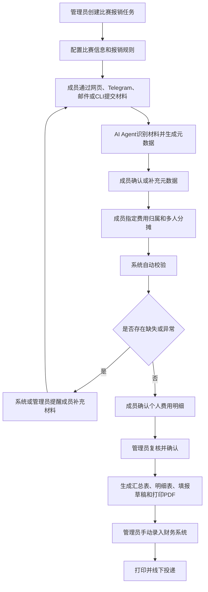

# 同济大学 ACM 竞赛报销收集系统需求分析文档

版本：V0.2  
状态：需求整理稿  
范围：第一阶段需求  
依据：用户访谈、同济大学 ACM 竞赛报销场景、示例财务报销材料

---

## 1. 需求背景

同济大学 ACM 竞赛报销过程中，参赛队员需要提交发票 PDF 及必要辅助材料，实验室管理员需要手动收集、分类、核对发票信息、检查附件缺失、计算个人和总报销金额，之后再手动录入财务系统并打印线下投递。

当前主要问题包括：

1. 队员需要自行整理发票、附件和说明材料，流程繁琐。
2. 管理员需要逐项复核发票抬头、税号、金额、类别、附件完整性，耗时较大。
3. 报销费用可能涉及多人分摊，尤其是报名费、住宿费、团队公共费用等，人工统计容易出错。
4. 财务系统不提供 API，最终仍需管理员人工录入网页表单。
5. 线下投递前需要整理打印材料，材料顺序、汇总表、明细表需要人工处理。
6. 现有流程缺少统一状态管理，难以及时发现成员未提交、材料缺失、金额未确认等问题。

本系统第一阶段目标不是直接替代财务系统，而是在财务系统录入之前，完成材料收集、识别、校验、分摊、确认、汇总和打印材料整理。

---

## 2. 业务目标

第一阶段系统需要达成以下业务目标：

1. 支持管理员为每场比赛创建一次独立的报销收集任务。
2. 支持配置比赛名称、地点、时间、成员名单、费用类别、截止时间、管理员、项目和报销人信息。
3. 支持全局配置发票抬头和税号，并在每次报销任务中默认继承。
4. 支持队员通过以下渠道提交发票和附件：
   - 网页表单；
   - Telegram；
   - 格式化邮件；
   - CLI 命令行工具。
5. 支持 AI Agent 对发票 PDF、图片、订单截图、行程单、支付记录、比赛通知等材料进行识别，并生成结构化元数据。
6. 支持系统自动校验：
   - 发票抬头；
   - 税号；
   - 发票金额；
   - 是否需要支付记录；
   - 费用类别所需附件；
   - 交易时间是否在比赛相关范围；
   - 交易地点是否与比赛地点或行程相关；
   - 发票号码是否重复。
7. 支持成员指定费用归属和多人分摊金额。
8. 支持所有相关成员确认个人费用明细和个人报销金额。
9. 支持管理员复核、人工更正和最终确认。
10. 支持导出：
    - 报销汇总表；
    - 成员报销明细表；
    - 发票明细表；
    - 缺失材料清单；
    - 财务填报草稿；
    - 合并打印 PDF。
11. 第一阶段不要求自动录入财务系统。
12. Browser Use 或 AI Agent 自动录入财务系统可作为后续阶段增强能力。

---

## 3. 用户角色

| 角色 | 描述 | 核心诉求 |
|---|---|---|
| 参赛队员 | 提交本人或团队相关发票、附件，指定费用归属，确认个人费用明细 | 少填信息、少整理材料、知道缺什么、确认金额正确 |
| 实验室管理员 | 创建报销任务、配置规则、复核材料、确认金额、整理财务提交材料 | 减少人工核对、快速发现缺失材料、生成可提交材料 |
| 系统 / AI Agent | 自动识别发票和附件内容，生成元数据，提示异常和缺失项 | 降低人工录入和人工检查工作量 |
| 财务系统 | 学校现有网页系统，第一阶段不直接对接 API | 接收管理员人工录入的报销信息 |
| 系统管理员 | 配置系统级参数、渠道、权限、全局发票信息 | 维护系统长期可用性和规则一致性 |

---

## 4. 业务范围

### 4.1 系统内范围

第一阶段包含以下能力：

1. 比赛报销任务创建与管理。
2. 抬头、税号、费用类别等规则配置。
3. 成员名单管理。
4. 多渠道材料提交。
5. 发票和附件识别。
6. 材料分类。
7. 发票和附件完整性校验。
8. 费用归属与多人分摊。
9. 成员费用确认。
10. 管理员复核和确认。
11. 报销汇总与明细导出。
12. 打印 PDF 合并。
13. CLI 提交渠道。
14. 基础操作日志和审计记录。

### 4.2 系统外范围

第一阶段不包含以下内容：

1. 财务系统 API 对接。
2. 自动完成财务网页系统提交。
3. 财务审批状态同步。
4. 线下投递后的流程跟踪。
5. 成员银行卡、财务账号等信息维护。
6. 替代财务处审核。
7. 自动判断所有政策合规性。

### 4.3 后续增强范围

以下能力可作为第二阶段或后续增强：

1. Browser Use 自动录入财务系统。
2. 财务系统页面自动填表。
3. 更多类型费用规则。
4. 历史比赛模板复用。
5. 智能拆分扫描 PDF。
6. 更完整的财务规则引擎。
7. 与学校统一身份认证对接。
8. 与企业微信、飞书等渠道对接。

---

## 5. 业务流程

### 5.1 主流程

1. 管理员创建比赛报销收集任务。
2. 管理员配置任务基础信息。
3. 成员通过网页表单、Telegram、格式化邮件或 CLI 提交材料。
4. 系统接收材料并归档到对应比赛任务。
5. AI Agent 识别材料内容并生成结构化元数据。
6. 成员确认或补充系统识别出的元数据。
7. 成员指定费用归属和分摊金额。
8. 系统执行自动校验。
9. 系统生成缺失材料和异常提醒。
10. 成员补充材料或修正信息。
11. 所有关联成员确认个人费用明细。
12. 管理员复核并确认最终报销数据。
13. 系统生成汇总表、明细表、财务填报草稿和合并打印 PDF。
14. 管理员人工录入财务系统。
15. 管理员打印材料并线下投递。

### 5.2 CLI 提交流程

1. 成员在本地准备发票 PDF、图片、订单截图、行程单、支付记录等文件。
2. 成员使用 CLI 登录或绑定身份。
3. 成员查询当前可提交的比赛报销任务。
4. 成员选择目标任务。
5. 成员执行 CLI 提交命令上传一个或多个文件。
6. CLI 将文件和可选元数据提交到系统后端。
7. 系统触发 AI Agent 识别。
8. CLI 返回上传结果、材料编号、识别状态和校验状态。
9. 成员通过 CLI 查询缺失材料、异常项和待确认费用。
10. 成员通过 CLI 或网页确认个人费用明细。

### 5.3 主流程图



---

## 6. 功能需求

### FR-001 创建比赛报销收集任务

- 需求描述：管理员可以为每场比赛创建一个独立的报销收集任务。
- 触发角色：实验室管理员
- 前置条件：
  - 管理员已登录系统；
  - 管理员具备创建报销任务权限。
- 输入：
  - 比赛名称；
  - 比赛地点；
  - 比赛起止时间；
  - 参赛人员名单；
  - 费用类别；
  - 管理员；
  - 截止时间；
  - 项目和报销人信息；
  - 发票抬头；
  - 税号。
- 处理逻辑：
  - 系统创建独立报销任务；
  - 抬头和税号默认继承全局配置；
  - 项目和报销人信息由管理员手动填写；
  - 成员名单用于后续提交、分摊、确认和权限判断；
  - 任务创建后可以开放给成员提交材料。
- 输出：
  - 报销任务；
  - 任务编号；
  - 提交入口。
- 异常情况：
  - 缺少比赛名称，不允许创建；
  - 缺少比赛起止时间，不允许创建；
  - 缺少成员名单，不允许发布任务；
  - 截止时间早于当前时间，系统提示错误。
- 优先级：Must
- 验收标准：
  - Given 管理员填写完整比赛信息  
    When 点击创建任务  
    Then 系统生成一个可收集材料的比赛报销任务
  - Given 抬头和税号已有全局配置  
    When 管理员创建新任务  
    Then 新任务默认继承全局抬头和税号

---

### FR-002 多渠道材料提交

- 需求描述：成员可以通过网页表单、Telegram、格式化邮件、CLI 工具提交发票和辅助材料。
- 触发角色：参赛队员
- 前置条件：
  - 报销任务已创建；
  - 报销任务处于开放提交状态；
  - 成员属于该比赛任务的参赛人员名单。
- 输入：
  - 发票 PDF；
  - 图片；
  - 订单截图；
  - 行程单；
  - 支付记录；
  - 比赛通知；
  - 其他辅助材料。
- 处理逻辑：
  - 系统将提交材料归入对应比赛任务；
  - 系统识别提交成员；
  - 不同渠道提交的材料进入统一材料管理流程；
  - 后续识别、校验、分摊、确认、导出逻辑保持一致；
  - 无法识别提交人或任务时，标记为待确认。
- 输出：
  - 材料提交记录；
  - 提交状态；
  - 材料编号。
- 异常情况：
  - 无法识别比赛任务；
  - 无法识别提交人；
  - 文件格式不可读；
  - 上传失败；
  - 文件重复提交。
- 优先级：Must
- 验收标准：
  - Given 成员上传发票 PDF 和附件  
    When 系统接收材料  
    Then 材料被归档到对应比赛任务和成员名下
  - Given 成员通过不同渠道提交材料  
    When 系统接收材料  
    Then 所有材料都进入同一报销任务的统一材料管理流程

---

### FR-003 AI Agent 辅助识别元数据

- 需求描述：系统通过 AI Agent 从发票和附件中识别结构化信息，减少成员手填内容。
- 触发角色：系统 / AI Agent
- 前置条件：
  - 成员已提交材料；
  - 文件可被系统读取。
- 输入：
  - 发票 PDF；
  - 扫描件；
  - 截图；
  - 行程单；
  - 比赛通知；
  - 支付记录。
- 处理逻辑：
  - 识别发票号码；
  - 识别开票日期；
  - 识别购买方名称；
  - 识别税号；
  - 识别销售方名称；
  - 识别金额；
  - 识别费用类型；
  - 识别交易时间；
  - 识别地点；
  - 识别乘车人、航班号、航段、座位等级、舱位等交通信息；
  - 对置信度不足的信息标记为待确认；
  - 允许成员或管理员人工更正。
- 输出：
  - 结构化材料元数据；
  - 识别置信度；
  - 待确认字段列表。
- 异常情况：
  - OCR 失败；
  - PDF 无法解析；
  - 多张票据混在一个文件中无法拆分；
  - 发票金额无法识别；
  - 日期、人员、地点无法识别。
- 优先级：Must
- 验收标准：
  - Given 成员上传一张铁路电子客票 PDF  
    When AI Agent 完成识别  
    Then 系统提取发票号码、票价、乘车人、出发地、到达地、乘车日期和购买方信息
  - Given 系统无法确定费用类型  
    When AI Agent 完成识别  
    Then 系统将费用类型标记为待确认

---

### FR-004 发票抬头和税号校验

- 需求描述：系统校验发票购买方名称和税号是否符合配置值。
- 触发角色：系统
- 前置条件：
  - 发票已识别；
  - 任务已配置标准抬头和税号。
- 输入：
  - 识别出的购买方名称；
  - 识别出的统一社会信用代码 / 纳税人识别号；
  - 系统配置的标准抬头；
  - 系统配置的标准税号。
- 处理逻辑：
  - 校验购买方名称是否匹配；
  - 校验税号是否匹配；
  - 不一致则标记为异常；
  - 未识别时标记为待确认。
- 输出：
  - 抬头校验结果；
  - 税号校验结果；
  - 异常说明。
- 异常情况：
  - 未识别到抬头；
  - 未识别到税号；
  - 抬头正确但税号缺失；
  - 税号正确但抬头异常。
- 优先级：Must
- 验收标准：
  - Given 系统配置抬头为“同济大学”  
    When 发票购买方名称不是“同济大学”  
    Then 系统标记该发票为抬头异常
  - Given 系统配置税号为指定值  
    When 发票税号与配置值不一致  
    Then 系统标记该发票为税号异常

---

### FR-005 附件完整性校验

- 需求描述：系统按费用类型和金额检查是否缺少必要附件。
- 触发角色：系统
- 前置条件：
  - 材料已识别；
  - 材料已归类或费用类别已由用户指定。
- 输入：
  - 费用类型；
  - 发票金额；
  - 附件列表；
  - 识别出的附件类型。
- 处理逻辑：
  - 单张发票金额 >= 1000 元时，需要支付记录；
  - 航空费用必须有发票或行程单之一；
  - 航空材料需注明航班舱位；
  - 航空材料未注明舱位时，需要订单截图；
  - 参赛费需附加带有支付要求的比赛通知；
  - 市内交通如为网约车，需有行程信息；
  - 其他规则应支持后续扩展。
- 输出：
  - 附件完整性校验结果；
  - 缺失材料清单；
  - 补充材料建议。
- 异常情况：
  - 无法判断费用类型；
  - 无法判断是否为网约车；
  - 支付记录金额与发票金额不一致；
  - 支付记录无法识别交易金额。
- 优先级：Must
- 验收标准：
  - Given 一张金额为 1500 元的报名费发票  
    When 成员未提交支付记录  
    Then 系统提示缺少支付记录
  - Given 一笔网约车费用  
    When 成员未提交行程信息  
    Then 系统提示缺少行程信息
  - Given 一笔参赛费  
    When 成员未提交带支付要求的比赛通知  
    Then 系统提示缺少比赛通知

---

### FR-006 比赛范围校验

- 需求描述：系统检查发票交易时间和地点是否与比赛范围相关。
- 触发角色：系统
- 前置条件：
  - 比赛信息已配置；
  - 发票或附件中已识别交易时间和地点。
- 输入：
  - 比赛起止时间；
  - 比赛地点；
  - 发票或附件中的实际交易时间；
  - 发票或附件中的交易地点、出发地、到达地。
- 处理逻辑：
  - 优先使用实际发生交易的时间，而不是开票时间；
  - 判断交易时间是否落在比赛相关合理区间内；
  - 判断地点是否与比赛城市、出发地、到达地或往返路径相关；
  - 对无法判断的情况标记为待确认；
  - 比赛范围检查优先级低于抬头、税号和附件完整性检查。
- 输出：
  - 时间范围校验结果；
  - 地点范围校验结果；
  - 待确认说明。
- 异常情况：
  - 只有开票时间，无交易时间；
  - 地点缺失；
  - 交易时间在比赛前后但可能合理；
  - 中转、提前到达、延后返程等场景无法自动判断。
- 优先级：Should
- 验收标准：
  - Given 比赛时间为 2025-10-31 至 2025-11-03  
    When 一张交通票交易时间为 2025-10-31  
    Then 系统判断该时间与比赛范围匹配
  - Given 系统只能识别开票日期，不能识别实际交易时间  
    When 执行范围校验  
    Then 系统标记为待确认，而不是直接判定失败

---

### FR-007 费用归属与多人分摊

- 需求描述：提交发票的成员可以指定费用归属给一个或多个成员，并分别指定金额。
- 触发角色：参赛队员
- 前置条件：
  - 发票已提交；
  - 发票金额已识别或已人工填写；
  - 归属成员在参赛人员名单中。
- 输入：
  - 发票金额；
  - 归属成员；
  - 每个成员分摊金额；
  - 备注。
- 处理逻辑：
  - 提交发票的成员负责指定费用归属；
  - 一张发票可以归属给一个或多个成员；
  - 每个成员可以指定不同金额；
  - 分摊金额之和必须等于发票金额；
  - 金额可以由系统识别后人工更正；
  - 多人共享费用需要所有相关成员确认。
- 输出：
  - 费用分摊明细；
  - 待确认成员列表。
- 异常情况：
  - 分摊金额之和不等于发票金额；
  - 指定成员不在参赛名单中；
  - 成员拒绝确认；
  - 发票提交人与费用归属人不一致。
- 优先级：Must
- 验收标准：
  - Given 一张 3000 元参赛费发票  
    When 提交人将其分摊给 3 名成员，每人 1000 元  
    Then 系统生成 3 条个人费用明细，并等待 3 名成员确认
  - Given 一张发票金额为 1500 元  
    When 分摊金额合计为 1400 元  
    Then 系统不允许提交分摊方案

---

### FR-008 成员费用确认

- 需求描述：成员需要确认自己的个人费用明细和最终报销金额。
- 触发角色：参赛队员
- 前置条件：
  - 系统已生成个人费用明细；
  - 成员已登录或完成身份识别。
- 输入：
  - 个人费用明细；
  - 确认操作；
  - 异议说明。
- 处理逻辑：
  - 成员可查看自己相关的费用明细；
  - 成员可查看与自己相关的发票和附件；
  - 成员确认后进入管理员复核；
  - 成员有异议时，状态回退为待处理；
  - 若管理员修改了成员金额，是否强制重新确认待确认。
- 输出：
  - 成员确认状态；
  - 确认时间；
  - 异议记录。
- 异常情况：
  - 成员逾期未确认；
  - 成员对金额提出异议；
  - 发票提交人与费用归属人不一致；
  - 成员无法登录系统。
- 优先级：Must
- 验收标准：
  - Given 成员名下有 3 条费用明细  
    When 成员点击确认  
    Then 系统记录该成员已确认个人费用明细
  - Given 成员对金额有异议  
    When 成员提交异议  
    Then 系统将对应明细标记为待处理

---

### FR-009 管理员复核与确认

- 需求描述：管理员复核所有材料、金额、缺失项和成员确认状态，并确认最终报销数据。
- 触发角色：实验室管理员
- 前置条件：
  - 成员已提交材料；
  - 系统已完成识别和校验。
- 输入：
  - 汇总表；
  - 成员明细；
  - 发票明细；
  - 缺失材料清单；
  - 校验结果；
  - 成员确认状态。
- 处理逻辑：
  - 管理员可查看全部材料；
  - 管理员可人工更正识别结果和金额；
  - 管理员可手动提醒成员补材料；
  - 管理员可查看自动提醒记录；
  - 所有 Must 校验通过后，可生成最终材料包；
  - 存在异常时，系统应明确提示风险。
- 输出：
  - 管理员确认状态；
  - 最终报销数据；
  - 可导出材料包。
- 异常情况：
  - 存在未确认成员；
  - 存在缺失材料；
  - 存在抬头税号错误；
  - 存在重复发票；
  - 存在分摊金额不一致。
- 优先级：Must
- 验收标准：
  - Given 所有成员已确认且无缺失材料  
    When 管理员点击确认  
    Then 系统将报销任务标记为可提交财务系统
  - Given 存在抬头税号错误  
    When 管理员尝试最终确认  
    Then 系统提示异常，不允许静默通过

---

### FR-010 输出报销材料

- 需求描述：系统输出管理员需要的报销结果文件。
- 触发角色：实验室管理员
- 前置条件：
  - 管理员已确认报销数据。
- 输入：
  - 任务内所有发票；
  - 附件；
  - 明细；
  - 校验结果；
  - 项目和报销人信息。
- 处理逻辑：
  - 生成报销汇总表；
  - 生成成员报销明细表；
  - 生成发票明细表；
  - 生成缺失材料清单；
  - 生成财务填报草稿；
  - 合并所有电子件为打印 PDF；
  - 打印 PDF 按系统默认顺序排列，暂无严格财务顺序要求。
- 输出：
  - Excel 或 CSV 汇总表；
  - PDF 材料包；
  - 财务系统填报信息草稿。
- 异常情况：
  - 存在无法读取的附件；
  - PDF 合并失败；
  - 部分字段缺失；
  - 文件过大导致导出失败。
- 优先级：Must
- 验收标准：
  - Given 报销任务已完成管理员确认  
    When 管理员导出材料  
    Then 系统生成汇总表、明细表、财务填报草稿和合并打印 PDF
  - Given 存在缺失材料  
    When 管理员导出缺失材料清单  
    Then 系统按成员和费用列出缺失项

---

### FR-011 财务系统 Browser Use 录入

- 需求描述：通过 AI Agent 或浏览器自动化辅助录入财务系统。
- 触发角色：管理员 / AI Agent
- 前置条件：
  - 财务填报草稿已生成；
  - 管理员已登录财务系统；
  - 自动化能力已开发。
- 输入：
  - 财务填报字段；
  - 财务系统页面。
- 处理逻辑：
  - 第一阶段不实现；
  - 后续阶段可评估可行性；
  - 需要人工确认每次提交。
- 输出：
  - 财务系统预约报销单。
- 异常情况：
  - 登录失败；
  - 页面结构变化；
  - 字段无法匹配；
  - 需要验证码；
  - 自动化误填。
- 优先级：Won’t，第一阶段不做
- 验收标准：
  - 第一阶段不验收。

---

### FR-012 CLI 材料提交渠道

- 需求描述：系统提供跨平台 CLI 工具，允许队员个人提交报销材料、补充元数据、查询校验结果、查看缺失材料，并支持 JSON 输出。
- 触发角色：参赛队员
- 前置条件：
  - 报销任务已创建；
  - 报销任务开放提交；
  - 队员属于该任务参赛人员名单；
  - 队员已通过 OAuth 或 Token 完成身份认证；
  - 队员本地已有待提交文件。
- 输入：
  - 比赛任务标识；
  - 提交人身份；
  - 发票 PDF；
  - 图片；
  - 辅助材料文件；
  - 可选元数据：费用类型、费用归属成员、分摊金额、备注。
- 处理逻辑：
  - CLI 通过 OAuth 或 Token 完成身份认证；
  - CLI 支持查询当前可提交任务；
  - CLI 将本地文件上传到系统；
  - 系统将材料归入指定比赛报销任务；
  - 系统触发 AI Agent 识别；
  - CLI 展示上传结果、识别状态、校验状态；
  - 如果缺少必要字段，CLI 提示用户补充；
  - 如果一次提交多个文件，系统支持批量上传；
  - CLI 支持 `--json` 输出机器可读结果；
  - CLI 需要跨平台支持，以 Unix 平台作为主要系统。
- 输出：
  - 上传成功 / 失败结果；
  - 材料编号；
  - 初步识别结果；
  - 缺失材料提醒；
  - 当前提交状态；
  - 可选 JSON 格式输出。
- 异常情况：
  - 未登录；
  - OAuth 授权失败；
  - Token 无效或过期；
  - 比赛任务不存在；
  - 用户不在参赛人员名单；
  - 文件不存在；
  - 文件格式不支持；
  - 网络中断；
  - 上传部分成功、部分失败；
  - 文件重复提交；
  - 元数据格式错误；
  - 分摊金额之和不等于发票金额；
  - CLI 版本过旧。
- 优先级：Must
- 验收标准：
  - Given 队员已登录 CLI 且存在开放中的报销任务  
    When 队员执行命令上传发票和行程单  
    Then 系统将材料归入该比赛任务，并返回提交成功状态
  - Given 队员一次上传多个文件  
    When 其中一个文件格式不支持  
    Then CLI 明确显示成功文件、失败文件和失败原因
  - Given 系统识别到单张发票金额大于等于 1000 元但未提交支付记录  
    When 队员查询提交状态  
    Then CLI 显示缺少支付记录的提醒
  - Given 队员执行带 `--json` 参数的状态查询命令  
    When CLI 返回结果  
    Then 输出合法 JSON，便于脚本处理

---

### FR-013 CLI 任务查询

- 需求描述：队员可通过 CLI 查询自己可提交或已参与的比赛报销任务。
- 触发角色：参赛队员
- 前置条件：
  - 队员已登录 CLI。
- 输入：
  - 用户身份；
  - 可选过滤条件：开放中、已截止、已完成。
- 处理逻辑：
  - 系统根据成员名单返回该队员可见任务；
  - 不返回无关比赛任务。
- 输出：
  - 任务编号；
  - 比赛名称；
  - 比赛时间；
  - 截止时间；
  - 任务状态。
- 异常情况：
  - 用户未登录；
  - Token 过期；
  - 无可见任务。
- 优先级：Must
- 验收标准：
  - Given 队员已绑定身份  
    When 执行任务列表命令  
    Then CLI 只显示该队员可参与的报销任务

---

### FR-014 CLI 状态查询与缺失材料查看

- 需求描述：队员可通过 CLI 查询本人提交材料的识别、校验、缺失材料和确认状态。
- 触发角色：参赛队员
- 前置条件：
  - 队员已登录 CLI；
  - 队员已有相关提交记录或费用明细。
- 输入：
  - 任务编号；
  - 可选材料编号；
  - 可选 `--json` 参数。
- 处理逻辑：
  - 系统返回本人相关材料状态；
  - 系统返回本人需要处理的缺失材料；
  - 系统返回本人待确认费用明细；
  - 不返回无关成员材料详情。
- 输出：
  - 材料状态；
  - 校验结果；
  - 缺失材料列表；
  - 待确认费用明细；
  - JSON 或文本格式结果。
- 异常情况：
  - 任务不存在；
  - 用户无权限查看；
  - 无材料记录。
- 优先级：Must
- 验收标准：
  - Given 队员已有提交记录  
    When 执行状态查询命令  
    Then CLI 显示该队员相关材料的当前处理状态
  - Given 队员使用 `--json`  
    When 查询缺失材料  
    Then CLI 输出结构化 JSON

---

### FR-015 CLI 个人费用确认

- 需求描述：队员可通过 CLI 确认自己的个人费用明细。
- 触发角色：参赛队员
- 前置条件：
  - 系统已生成个人费用明细；
  - 队员已登录 CLI。
- 输入：
  - 任务编号；
  - 确认操作；
  - 可选异议说明。
- 处理逻辑：
  - CLI 展示个人费用明细；
  - 队员确认后，系统记录确认状态；
  - 队员提出异议时，系统将对应明细标记为待处理。
- 输出：
  - 确认结果；
  - 当前确认状态。
- 异常情况：
  - 存在待确认的异常费用；
  - 成员试图确认无关费用；
  - 费用明细已被管理员修改，需要重新拉取最新版本。
- 优先级：Should
- 验收标准：
  - Given 队员有待确认费用明细  
    When 执行 CLI 确认命令  
    Then 系统记录该队员已确认
  - Given 队员提交异议说明  
    When 执行 CLI 异议命令  
    Then 系统将对应费用明细标记为有异议

---

## 7. CLI 用户操作能力

以下为需求层面的 CLI 操作能力，不限定具体技术实现。

```bash
reim login
reim list-tasks
reim submit --task <task-id> <files...>
reim submit --task <task-id> --type railway ticket.pdf
reim status --task <task-id>
reim missing --task <task-id>
reim split --invoice <invoice-id> --member <student-id>:<amount> --member <student-id>:<amount>
reim confirm --task <task-id>
reim status --task <task-id> --json
```

| 能力 | 说明 | 优先级 |
|---|---|---|
| 登录 / 绑定身份 | 通过 OAuth 或 Token 识别提交人身份 | Must |
| 查看可提交任务 | 查看当前开放中的比赛报销任务 | Must |
| 上传文件 | 上传发票和附件 | Must |
| 批量上传 | 一次提交多个文件 | Must |
| 查询状态 | 查看识别、校验、缺失材料状态 | Must |
| 查看缺失材料 | 输出本人需要补充的材料清单 | Must |
| JSON 输出 | 支持机器可读输出，便于脚本化处理 | Must |
| 补充分摊信息 | 指定费用归属和多人金额 | Should |
| 成员确认 | CLI 确认个人费用明细 | Should |
| 本地预检查 | 提交前检查文件存在、格式、大小 | Should |
| 目录递归上传 | 上传某目录下的材料文件 | Could |

---

## 8. 非功能需求

| 类型 | 需求 |
|---|---|
| 易用性 | 成员提交时应尽量少填字段，系统自动识别后让成员确认或修正 |
| 识别准确性 | 关键字段包括发票号码、金额、抬头、税号，应在识别失败时明确标记为待确认 |
| 性能 | 单个报销任务中 100 份以内材料应能在可接受时间内完成识别，具体时间待确认 |
| 安全 | 成员只能查看与自己相关的费用明细和材料状态 |
| 隐私 | 发票、身份证部分信息、手机号、支付截图等属于敏感信息，需要访问控制 |
| 可维护性 | 附件规则、费用类别、抬头税号应可配置 |
| 可扩展性 | 后续应支持新增费用类型、新增校验规则和新增提交渠道 |
| 日志与审计 | 系统需记录金额修改、材料补充、管理员确认、成员确认等操作日志 |
| 数据可靠性 | 原始上传文件不得被覆盖，多次补充材料应保留提交记录 |
| 可追溯性 | 每条费用明细应可追溯到对应发票、附件、提交人和确认人 |
| CLI 兼容性 | CLI 要求跨平台支持，以 Unix 平台作为主要系统 |
| CLI 自动化 | CLI 必须支持 JSON 输出，便于脚本化调用 |
| 可用性 | 单个渠道故障不应影响其他渠道提交材料 |
| 数据备份 | 报销材料和结构化数据应具备备份机制，具体策略待确认 |

---

## 9. 数据需求

| 数据对象 | 字段 | 类型 | 是否必填 | 说明 |
|---|---|---|---|---|
| 报销任务 | 任务编号 | 文本 | 是 | 系统生成 |
| 报销任务 | 比赛名称 | 文本 | 是 | 每场比赛一次任务 |
| 报销任务 | 比赛地点 | 文本 | 是 | 用于范围校验 |
| 报销任务 | 比赛起止时间 | 日期 | 是 | 用于交易时间校验 |
| 报销任务 | 截止时间 | 日期时间 | 是 | 成员提交截止时间 |
| 报销任务 | 发票抬头 | 文本 | 是 | 默认继承全局配置 |
| 报销任务 | 税号 | 文本 | 是 | 默认继承全局配置 |
| 报销任务 | 费用类别 | 枚举 | 是 | 参赛费、铁路、航空、市内交通、住宿费等 |
| 报销任务 | 管理员 | 用户引用 | 是 | 任务负责人 |
| 报销任务 | 项目信息 | 文本 | 是 | 管理员手动填写 |
| 报销任务 | 报销人信息 | 文本 | 是 | 管理员手动填写 |
| 报销任务 | 任务状态 | 枚举 | 是 | 草稿、开放中、已截止、复核中、已完成 |
| 成员 | 学号 | 文本 | 是 | 成员唯一标识之一 |
| 成员 | 姓名 | 文本 | 是 | 用于展示和确认 |
| 成员 | 账号绑定信息 | 文本 | 否 | 用于网页、Telegram、邮件、CLI 识别 |
| 材料 | 材料编号 | 文本 | 是 | 系统生成 |
| 材料 | 文件 | PDF/图片/其他 | 是 | 发票或附件 |
| 材料 | 文件类型 | 枚举 | 否 | 发票、订单截图、行程单、支付记录、比赛通知 |
| 材料 | 提交渠道 | 枚举 | 是 | Web、Telegram、Email、CLI |
| 材料 | 提交人 | 用户引用 | 是 | 谁提交 |
| 材料 | 提交时间 | 日期时间 | 是 | 系统记录 |
| 材料 | 文件哈希 | 文本 | 是 | 用于重复提交检测 |
| 发票 | 发票号码 | 文本 | 是 | 用于验重 |
| 发票 | 发票类别 | 文本 | 否 | 普通发票、铁路电子客票等 |
| 发票 | 开票日期 | 日期 | 否 | 不能替代交易时间 |
| 发票 | 交易时间 | 日期时间 | 否 | 比赛范围校验优先使用 |
| 发票 | 购买方名称 | 文本 | 是 | 抬头校验 |
| 发票 | 税号 | 文本 | 是 | 税号校验 |
| 发票 | 销售方名称 | 文本 | 否 | 用于辅助识别 |
| 发票 | 金额 | 金额 | 是 | 汇总和支付记录校验 |
| 发票 | 费用类型 | 枚举 | 是 | 可由 AI 识别后人工确认 |
| 发票 | 识别置信度 | 数值 | 否 | 用于提示人工复核 |
| 费用分摊 | 分摊编号 | 文本 | 是 | 系统生成 |
| 费用分摊 | 发票 | 引用 | 是 | 关联具体发票 |
| 费用分摊 | 归属成员 | 引用 | 是 | 可多人 |
| 费用分摊 | 分摊金额 | 金额 | 是 | 分摊金额和等于发票金额 |
| 费用分摊 | 说明 | 文本 | 否 | 分摊原因或备注 |
| 确认记录 | 成员 | 引用 | 是 | 谁确认 |
| 确认记录 | 费用明细 | 引用 | 是 | 确认哪条费用 |
| 确认记录 | 状态 | 枚举 | 是 | 待确认、已确认、有异议 |
| 确认记录 | 确认时间 | 日期时间 | 否 | 成员确认时间 |
| 校验结果 | 校验项 | 枚举 | 是 | 抬头、税号、附件、时间、地点、重复 |
| 校验结果 | 状态 | 枚举 | 是 | 通过、警告、失败、待确认 |
| 校验结果 | 说明 | 文本 | 否 | 异常说明 |
| CLI 提交记录 | 本地文件名 | 文本 | 是 | 用于用户识别提交文件 |
| CLI 提交记录 | 提交命令参数 | JSON | 否 | 记录用户提供的元数据 |
| CLI 提交记录 | 上传状态 | 枚举 | 是 | 成功、失败、部分成功 |
| CLI 提交记录 | 错误信息 | 文本 | 否 | 失败原因 |
| CLI 客户端 | 客户端版本 | 文本 | 是 | 用于兼容性排查 |
| CLI 客户端 | 输出格式 | 枚举 | 否 | text、json |
| 操作日志 | 操作人 | 用户引用 | 是 | 谁执行操作 |
| 操作日志 | 操作类型 | 枚举 | 是 | 提交、识别、更正、确认、导出等 |
| 操作日志 | 操作时间 | 日期时间 | 是 | 系统记录 |
| 操作日志 | 操作内容 | JSON | 否 | 修改前后差异 |

---

## 10. 权限需求

| 角色 | 可执行操作 | 不可执行操作 |
|---|---|---|
| 参赛队员 | 提交材料、查看本人相关费用、指定费用分摊、确认本人费用、补充材料、使用 CLI 查询本人状态 | 查看无关成员费用明细、修改他人提交内容、确认最终报销任务 |
| 实验室管理员 | 创建任务、配置规则、查看全部材料、修正识别结果、提醒补材料、确认最终报销、导出文件 | 绕过系统审计日志进行数据修改 |
| 系统 / AI Agent | 识别材料、生成元数据、执行校验、生成提醒 | 在无人确认情况下最终提交财务系统 |
| 系统管理员 | 配置全局抬头税号、费用类别、渠道配置、权限 | 直接替代财务系统审批 |
| CLI 客户端 | 代表已认证队员提交材料、查询状态、输出结果 | 未认证访问任务数据、查看无关成员数据 |

---

## 11. 外部依赖

| 外部依赖 | 说明 |
|---|---|
| 学校财务网页系统 | 第一阶段不对接 API，由管理员手动录入 |
| 发票 PDF / 图片 | 需要 OCR 或 PDF 解析能力 |
| Telegram | 作为材料提交渠道之一 |
| 邮件系统 | 支持格式化邮件提交 |
| CLI 客户端运行环境 | 需要跨平台支持，以 Unix 平台作为主要系统 |
| 网络连接 | CLI 和其他渠道需要访问报销系统后端 |
| 用户认证机制 | CLI 需要 OAuth 或 Token 登录 |
| 本地文件系统 | CLI 从本地读取 PDF、图片等材料 |
| 比赛通知 | 用于参赛费附件校验 |
| 行程单 / 订单截图 / 支付记录 | 用于交通、住宿、航空和大额发票校验 |
| 同济财务规则 | 例如大额发票支付记录要求，后续可能变化 |
| AI Agent | 用于材料识别、元数据生成、缺失项判断 |
| PDF 合并工具 | 用于生成打印材料包 |
| 表格导出工具 | 用于生成汇总表和明细表 |

---

## 12. 异常场景与边界条件

1. 发票抬头错误。
2. 发票税号错误。
3. 发票金额 >= 1000 元但无支付记录。
4. 发票号码重复提交。
5. 发票只有开票时间，没有实际交易时间。
6. 交易时间超出比赛合理范围。
7. 交易地点和比赛地点不相关。
8. 航空发票缺少舱位信息，且无订单截图。
9. 市内交通为网约车但缺少行程单。
10. 参赛费缺少包含支付要求的比赛通知。
11. 多人分摊金额之和不等于发票金额。
12. 费用归属成员不在参赛名单中。
13. 成员逾期未确认个人费用明细。
14. AI Agent 识别置信度低。
15. PDF 文件损坏或扫描件无法识别。
16. 同一张发票被多个成员重复提交。
17. 管理员人工修改金额后，是否强制重新确认待确认。
18. CLI 登录失败。
19. CLI Token 过期。
20. OAuth 授权失败。
21. CLI 上传过程中网络中断。
22. 批量上传时部分文件成功、部分失败。
23. CLI 上传的文件与网页、Telegram 或邮件渠道已有文件重复。
24. 用户指定了不存在的比赛任务。
25. 用户不在该比赛任务的参赛人员名单中。
26. 用户指定的费用类型不在任务允许类别中。
27. CLI 版本过旧，不兼容当前服务端。
28. 本地文件路径错误或权限不足。
29. 成员在 CLI 中提交的分摊信息与系统识别金额不一致。
30. 邮件格式不符合要求。
31. Telegram 账号无法匹配成员身份。
32. 管理员最终确认时仍存在未处理异常。
33. PDF 合并过程中存在加密文件或损坏文件。
34. 导出表格字段缺失。
35. 成员重复提交同一附件但文件名不同。
36. 实际交易时间合理但超出比赛起止日期，例如提前一天到达或延后一天返程。

---

## 13. 待确认问题

| 编号 | 问题 | 影响范围 | 优先级 |
|---|---|---|---|
| Q-001 | 交易时间合理范围是否允许比赛前后各扩展若干天？ | 比赛范围校验 | 高 |
| Q-002 | 住宿费、参赛费等多人共享费用是否需要默认分摊规则？ | 费用分摊 | 中 |
| Q-003 | 管理员修改成员金额后，是否必须重新让成员确认？ | 审批流程 | 高 |
| Q-004 | PDF 合并顺序是否需要固定为“报销单-发票明细-附件-发票”？ | 打印材料 | 中 |
| Q-005 | 系统是否需要保存历史成员名单，用于下次比赛复用？ | 数据管理 | 中 |
| Q-006 | 材料完成报销后保存多久？ | 数据合规与存储 | 中 |
| Q-007 | 格式化邮件的格式规范是什么？ | 邮件提交渠道 | 中 |
| Q-008 | Telegram 提交是否需要绑定学号和账号？ | 身份识别 | 高 |
| Q-009 | 是否需要导出 Excel，还是 CSV 即可？ | 输出格式 | 中 |
| Q-010 | 是否需要支持撤回、重新提交和版本记录？ | 材料管理 | 中 |
| Q-011 | CLI 是否需要支持离线整理，联网后一次性同步？ | CLI 使用体验 | 中 |
| Q-012 | CLI 是否需要支持目录递归上传？ | CLI 批量提交 | 中 |
| Q-013 | CLI 的 OAuth 或 Token 具体认证方式如何选择？ | 安全与易用性 | 高 |
| Q-014 | Windows 是否要求第一阶段完整支持，还是只保证基础可运行？ | CLI 兼容性 | 中 |
| Q-015 | JSON 输出字段是否需要保持长期稳定以供脚本依赖？ | CLI 自动化 | 中 |
| Q-016 | AI Agent 识别失败时，成员必须补充哪些最小字段？ | 提交流程 | 高 |
| Q-017 | 发票内容是否符合比赛范围的判断阈值如何定义？ | 规则判断 | 中 |
| Q-018 | 是否需要管理员代成员确认费用？ | 权限与流程 | 中 |
| Q-019 | 是否需要对支付记录和发票金额做精确匹配？ | 附件校验 | 中 |
| Q-020 | 是否需要支持一个附件对应多张发票？ | 材料关联 | 中 |

---

## 14. 需求优先级

### 14.1 Must have

1. 创建比赛报销任务。
2. 配置比赛基础信息、成员名单、截止时间。
3. 配置或继承全局发票抬头和税号。
4. 管理员手动填写项目和报销人信息。
5. 成员通过网页提交发票和附件。
6. 成员通过 Telegram 提交发票和附件。
7. 成员通过格式化邮件提交发票和附件。
8. 成员通过 CLI 提交发票和附件。
9. CLI OAuth 或 Token 登录。
10. CLI 查看可提交报销任务。
11. CLI 上传单个或多个材料文件。
12. CLI 查询提交状态。
13. CLI 查看缺失材料提醒。
14. CLI 支持 JSON 输出。
15. AI Agent 识别发票与附件元数据。
16. 抬头和税号校验。
17. 大额发票支付记录校验。
18. 航空、参赛费、市内交通附件完整性校验。
19. 发票号码系统内重复检查。
20. 成员指定费用归属和多人分摊。
21. 成员确认个人费用明细。
22. 管理员复核确认。
23. 导出报销汇总表。
24. 导出成员明细表。
25. 导出发票明细表。
26. 导出缺失材料清单。
27. 生成财务填报草稿。
28. 合并打印 PDF。
29. 基础权限控制。
30. 基础操作日志。

### 14.2 Should have

1. 比赛范围校验，包括交易时间和地点。
2. 管理员手动提醒和系统自动提醒。
3. 识别置信度提示。
4. CLI 补充费用类型。
5. CLI 指定费用归属和多人分摊。
6. CLI 成员确认个人费用明细。
7. CLI 本地文件预检查。
8. 操作修改记录。
9. 支持成员异议流程。
10. 支持材料补充后重新校验。
11. 支持导出 Excel。
12. 支持 PDF 默认排序规则。

### 14.3 Could have

1. 历史成员信息复用。
2. 常见比赛模板。
3. 更智能的附件匹配。
4. 更丰富的 PDF 排序规则。
5. 自动生成成员补材料消息。
6. AI 辅助解释异常原因。
7. CLI 离线暂存后同步。
8. CLI 目录递归上传。
9. CLI 自动按文件名推断费用类型。
10. CLI 与脚本或 CI 环境集成。
11. 支持更多提交渠道。
12. 支持多语言 OCR 或复杂扫描件优化。

### 14.4 Won’t have，第一阶段不做

1. 财务系统 API 对接。
2. AI Agent Browser Use 自动录入财务系统。
3. 财务审批状态同步。
4. 线下投递后的流程跟踪。
5. 银行卡等财务系统内个人信息维护。
6. CLI 直接录入财务系统。
7. CLI 保存完整财务系统登录态。
8. 自动完成财务最终提交。
9. 替代财务处审核。
10. 自动判断所有政策性合规问题。

---

## 15. 验收指标汇总

| 编号 | 验收对象 | 验收标准 |
|---|---|---|
| AC-001 | 报销任务创建 | 管理员可创建包含比赛名称、地点、时间、成员名单、费用类别、截止时间的任务 |
| AC-002 | 抬头税号配置 | 新任务默认继承全局抬头和税号 |
| AC-003 | 多渠道提交 | Web、Telegram、邮件、CLI 提交的材料进入统一材料池 |
| AC-004 | CLI 提交 | 队员可通过 CLI 上传一个或多个文件 |
| AC-005 | CLI JSON 输出 | CLI 使用 `--json` 时输出合法 JSON |
| AC-006 | 发票识别 | 系统可识别发票号码、金额、购买方名称、税号、开票日期等关键字段 |
| AC-007 | 抬头税号校验 | 抬头或税号不匹配时系统标记异常 |
| AC-008 | 大额支付记录校验 | 单张发票金额 >= 1000 元且无支付记录时系统提示缺失 |
| AC-009 | 附件完整性校验 | 参赛费、航空、市内交通等按规则提示缺失材料 |
| AC-010 | 费用分摊 | 一张发票可分摊给多人，且分摊金额合计必须等于发票金额 |
| AC-011 | 成员确认 | 成员可确认或提出异议 |
| AC-012 | 管理员复核 | 管理员可查看全部材料、校验结果和成员确认状态 |
| AC-013 | 导出汇总表 | 管理员可导出按费用类型和成员统计的汇总表 |
| AC-014 | 导出 PDF | 管理员可导出包含所有电子件的合并打印 PDF |
| AC-015 | 权限隔离 | 成员不能查看无关成员费用明细 |
| AC-016 | 重复发票检查 | 同一发票号码重复提交时系统提示异常 |
| AC-017 | 缺失材料提醒 | 系统可按成员列出需要补充的材料 |
| AC-018 | 审计记录 | 系统记录金额修改、材料补充、确认和导出等关键操作 |

---

## 16. 第一阶段建议交付物

1. 报销任务管理模块。
2. 成员名单管理模块。
3. 材料上传与归档模块。
4. Web 提交入口。
5. Telegram 提交入口。
6. 邮件提交入口。
7. CLI 客户端。
8. AI Agent 识别模块。
9. 发票和附件校验模块。
10. 费用分摊与确认模块。
11. 管理员复核后台。
12. 汇总表和明细表导出模块。
13. 合并打印 PDF 生成模块。
14. 基础权限和审计模块。

---

## 17. 术语说明

| 术语 | 含义 |
|---|---|
| 报销任务 | 每场比赛对应的一次材料收集和报销整理任务 |
| 材料 | 成员提交的发票、附件、截图、通知等文件 |
| 发票 | 可用于报销的电子发票、铁路电子客票等 |
| 附件 | 支付记录、订单截图、行程单、比赛通知等辅助材料 |
| 费用分摊 | 将一张发票或一笔费用分配给一个或多个成员 |
| 个人费用明细 | 某成员最终需要确认的所有相关费用 |
| 财务填报草稿 | 系统根据材料整理出的财务系统录入参考信息 |
| 合并打印 PDF | 将所有电子材料按系统顺序合并生成的打印文件 |
| CLI | 命令行提交工具，主要面向队员个人提交材料 |
| AI Agent | 用于识别材料、生成元数据和提示缺失项的智能辅助模块 |

---

## 18. 变更记录

| 版本 | 变更内容 |
|---|---|
| V0.1 | 根据初步访谈整理比赛报销收集、识别、校验、分摊、导出需求 |
| V0.2 | 新增 CLI 提交渠道，明确 CLI 面向队员个人提交，支持 OAuth 或 Token，支持 JSON 输出，要求跨平台且以 Unix 平台为主 |

---

## 19. 实现状态

更新时间：2026-04-28

| 需求项 | 当前状态 | 说明 |
|---|---|---|
| FR-001 创建比赛报销收集任务 | 部分完成 | 已实现后端 API、基础字段校验、任务查询、任务状态流转和数据库持久化；尚未实现管理员认证、成员名单实体化和前端页面 |
| FR-002 多渠道材料提交 | 部分完成 | 已实现统一材料提交 API、Web/CLI/Telegram/Email 渠道枚举、文件哈希和同任务重复文件标记；尚未实现真实 Web 表单、Telegram Bot、邮件接入和对象存储 |
| FR-003 AI Agent 辅助识别元数据 | 未开始 | 尚未实现 OCR、PDF 解析和 AI 结构化识别 |
| FR-004 发票抬头和税号校验 | 部分完成 | 已实现发票结构化数据人工录入、发票抬头校验、税号校验和同任务内发票号码重复校验；尚未接入 AI 自动识别结果和管理员复核处理 |
| FR-005 附件完整性校验 | 未开始 | 尚未实现附件关联和规则校验 |
| FR-006 比赛范围校验 | 未开始 | 尚未实现交易时间和地点规则 |
| FR-007 费用归属与多人分摊 | 未开始 | 尚未实现费用分摊实体和金额约束 |
| FR-008 成员费用确认 | 未开始 | 尚未实现成员确认和异议流程 |
| FR-009 管理员复核与确认 | 未开始 | 尚未实现管理员复核后台和最终确认约束 |
| FR-010 输出报销材料 | 未开始 | 尚未实现表格导出和 PDF 合并 |
| FR-011 财务系统 Browser Use 录入 | 不在第一阶段 | 按需求文档第一阶段不实现 |
| FR-012 CLI 材料提交渠道 | 未开始 | 服务端材料提交 API 已具备复用基础，但 CLI 客户端尚未实现 |
| FR-013 CLI 任务查询 | 未开始 | 服务端任务查询 API 已具备复用基础，但 CLI 客户端尚未实现 |
| FR-014 CLI 状态查询与缺失材料查看 | 未开始 | 尚未实现 CLI 客户端、缺失材料规则和聚合状态接口 |
| FR-015 CLI 个人费用确认 | 未开始 | 尚未实现 CLI 客户端和费用确认模块 |
